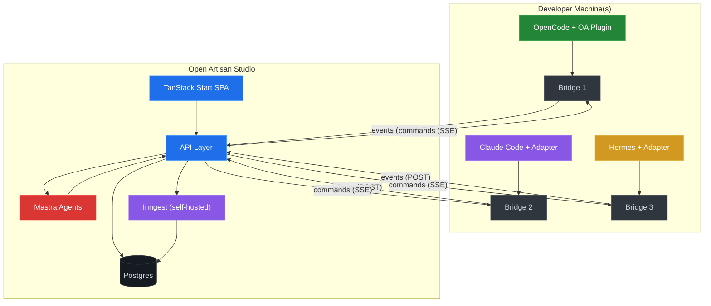
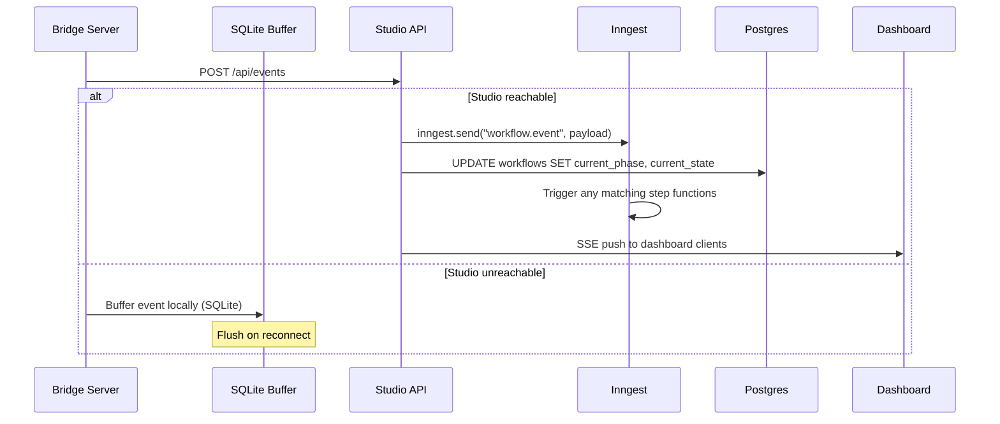
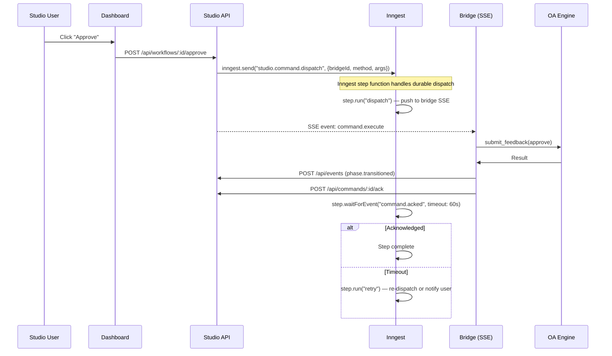
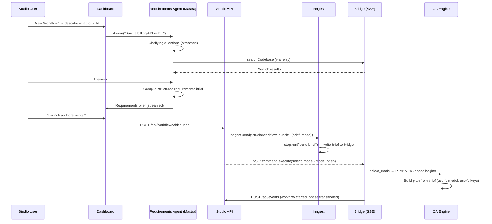
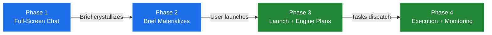

# Open Artisan Studio — Design Document

**Version:** v3 (March 2026)
**Status:** Design. Hosted control plane for the Open Artisan workflow engine.

---

## 1. What This Is

Open Artisan Studio is the hosted control plane for Open Artisan workflows. The open source engine runs locally in the developer's terminal (OpenCode, Claude Code, Hermes, OpenClaw). Studio provides centralized visibility, interaction, coordination, and AI-assisted planning across workflows, projects, and team members.

**One-sentence pitch:** Plan, monitor, and steer your AI agents from a single continuous experience — from initial conversation to live DAG execution.

---

## 2. Architecture Overview



### 2.1 Component Responsibilities

| Component | Role | Technology |
|---|---|---|
| **TanStack Start** | SPA dashboard, server functions, typed routing | React + SSR |
| **Mastra** | AI agents: requirements capture, codebase search, analytics | TypeScript agent framework |
| **Inngest** (self-hosted) | Event store, durable execution, fan-out coordination, step-level traces | Self-hosted with Postgres backend |
| **Postgres** | Relational data: teams, users, bridges, workflows, artifacts, reviews | Plain Postgres (no TimescaleDB) |
| **Bridge** | Local engine interface. Events up (POST), commands down (SSE). | Open Artisan engine JSON-RPC |

### 2.2 Why These Three

**Mastra** powers the AI features in Studio. The requirements capture assistant and analytics agent are Mastra agents with tools, memory, and model routing. The requirements agent is lightweight — it structures a conversation and searches the codebase, but does not generate the plan itself. Plan generation happens on the user's machine via the Open Artisan engine using their own model and API keys. This means near-zero LLM token cost for Studio.

**Inngest** replaces both TimescaleDB and custom coordination code. Bridge events are sent to Inngest, which stores them with built-in querying, replay, and step-level traces. Durable step functions handle command dispatch to bridges (retry on failure, timeout, acknowledgment tracking), DAG coordination across parallel bridges, and multi-step workflows like "plan approved in Studio → write artifact → send to bridge → confirm receipt → update state." Inngest self-hosted runs as a single binary with Postgres, so the infrastructure stays simple.

**What we don't need anymore:**
- ~~TimescaleDB~~ — Inngest provides event storage with querying. For time-series aggregation (workflow metrics, phase duration averages), we query Inngest's event data or maintain lightweight Postgres materialized views.
- ~~Custom event hypertable~~ — Inngest is the event store.
- ~~Custom pending_commands table~~ — Inngest step functions track command state (pending, dispatched, acknowledged, failed).
- ~~Custom retry/timeout logic for commands~~ — Inngest handles this natively.

### 2.3 Connection Model

**Transport (SSE + POST, unchanged from v2):**
- **Events (bridge → Studio):** HTTPS POST to Studio API, which forwards to Inngest via `inngest.send()`.
- **Commands (Studio → bridge):** SSE stream. Bridge opens outbound SSE connection. Studio pushes commands as SSE events. Auto-reconnect with `Last-Event-ID`.

**Connection modes:**
- **Disconnected (free):** Bridge runs locally, no Studio connection. Open source engine works identically.
- **Connected (paid):** Bridge opens outbound HTTPS to Studio. `openartisan connect <team-token>`.

---

## 3. Data Flow

### 3.1 Events (Bridge → Studio → Inngest)



Events serve dual purpose: Inngest stores them for history/replay/traces, and Postgres gets lightweight state updates (current phase, artifact status) for fast dashboard queries.

### 3.2 Commands (Studio → Bridge via SSE + Inngest)



Inngest makes command dispatch durable. If the bridge disconnects before acknowledging, Inngest retries. If the bridge is unreachable for 60 seconds, Inngest notifies the user in Studio. No custom retry logic needed.

### 3.3 Requirements Capture → Engine Handoff



The requirements agent captures intent. The engine builds the plan. Plan generation uses the user's configured model and API keys — zero token cost for Studio.

---

## 4. Inngest Event Schema

All bridge events and Studio actions are Inngest events. The event name hierarchy:

```typescript
// Bridge → Studio events (via POST /api/events → inngest.send())
"workflow/started"           // select_mode completed
"workflow/completed"         // phase reached DONE
"phase/transitioned"         // any state transition
"phase/approved"             // user approved at USER_GATE
"review/completed"           // mark_satisfied returned
"review/escalated"           // iteration cap reached
"task/dispatched"            // scheduler dispatched task
"task/completed"             // mark_task_complete succeeded
"task/aborted"               // task or cascade abort
"escape-hatch/triggered"     // strategic change detected
"escape-hatch/resolved"      // user responded
"orchestrator/routed"        // feedback classified
"discovery/completed"        // scanner fleet finished
"error/occurred"             // engine error (non-fatal)
"orchestrator/feedback-requested"  // orchestrator needs user input (triggered by idle nudge)

// Studio → Bridge commands (via Inngest step functions)
"studio/command.dispatch"    // approve, revise, amend, etc.
"studio/command.acked"       // bridge acknowledged
"studio/message.inject"      // user message from dashboard
"studio/message.acked"       // bridge acknowledged message routing
"studio/artifact.fetch"      // request artifact content relay
"studio/artifact.received"   // bridge returned content
"studio/workflow.launch"     // requirements capture → start workflow with brief

// Mastra agent events
"studio/requirements.completed"
"studio/analytics.query"
```

### 4.1 Event Payload (Common Envelope)

```typescript
interface StudioEventData {
  // Source
  bridgeId: string
  sessionId: string
  featureName: string
  projectHash: string         // SHA-256 of repo root

  // Context (for spatial placement in dashboard)
  phase: Phase
  phaseState: PhaseState
  mode: WorkflowMode | null
  activeAgent: string | null
  taskId: string | null       // for task-level events

  // Team
  teamId: string

  // Content
  [key: string]: unknown      // event-specific payload
}
```

---

## 5. Inngest Functions

### 5.1 Command Dispatch (Durable)

```typescript
const dispatchCommand = inngest.createFunction(
  { id: "dispatch-bridge-command", retries: 3 },
  { event: "studio/command.dispatch" },
  async ({ event, step }) => {
    const { bridgeId, method, args, context } = event.data

    // Step 1: Push command to bridge's SSE stream
    await step.run("push-to-bridge", async () => {
      await pushSSECommand(bridgeId, { method, args, context })
    })

    // Step 2: Wait for bridge acknowledgment (60s timeout)
    const ack = await step.waitForEvent("studio/command.acked", {
      match: "data.commandId",
      timeout: "60s",
    })

    if (!ack) {
      // Step 3: Notify user that command wasn't acknowledged
      await step.run("notify-timeout", async () => {
        await notifyUser(event.data.teamId, {
          type: "command-timeout",
          bridgeId,
          method,
          message: `Bridge did not acknowledge ${method}. It may be offline.`
        })
      })
      return { status: "timeout" }
    }

    return { status: "acked", result: ack.data.result }
  }
)
```

### 5.2 Workflow Launch (Requirements Brief → Bridge)

```typescript
const launchWorkflow = inngest.createFunction(
  { id: "launch-workflow-from-studio" },
  { event: "studio/workflow.launch" },
  async ({ event, step }) => {
    const { bridgeId, featureName, mode, requirementsBrief } = event.data

    // Step 1: Send requirements brief and start workflow
    // The engine receives the brief as intentBaseline for PLANNING
    await step.run("start-workflow", async () => {
      await pushSSECommand(bridgeId, {
        method: "tool.execute",
        args: {
          name: "select_mode",
          args: {
            mode,
            feature_name: featureName,
            intent_baseline: requirementsBrief  // Engine uses this to build the plan
          }
        }
      })
    })

    // Step 2: Wait for workflow to start
    const started = await step.waitForEvent("workflow/started", {
      match: "data.featureName",
      timeout: "60s",
    })

    return { status: started ? "launched" : "timeout" }
  }
)
```

### 5.3 Message Inject (Durable)

```typescript
const injectMessage = inngest.createFunction(
  { id: "inject-studio-message", retries: 2 },
  { event: "studio/message.inject" },
  async ({ event, step }) => {
    const { bridgeId, sessionId, text, context } = event.data

    await step.run("push-message", async () => {
      await pushSSECommand(bridgeId, {
        method: "message.inject",
        args: { sessionId, text, context }
      })
    })

    const ack = await step.waitForEvent("studio/message.acked", {
      match: "data.messageId",
      timeout: "60s",
    })

    if (!ack) {
      return { status: "timeout", delivered: false }
    }

    return {
      status: "delivered",
      classification: ack.data.classification,
      action: ack.data.action
    }
  }
)
```

---

## 6. Mastra Agents

### 6.1 Requirements Capture Agent

The requirements agent runs inside Studio as a Mastra agent. It helps users define clear, structured requirements through conversation. It does NOT generate the plan — that happens on the user's machine via the Open Artisan engine using their own model and API keys.

```typescript
const requirementsAgent = new Agent({
  name: "requirements-capture",
  model: anthropic("claude-haiku-4-20250414"),  // Lightweight — just structuring conversation
  instructions: `You are a requirements capture assistant. Your job is to help the user
    define clear, unambiguous requirements for a software development task.
    
    Ask clarifying questions about: scope, architecture approach, error handling,
    integration points, data model, constraints, and non-functional requirements.
    
    You can search the user's codebase to understand existing patterns and context.
    
    When the user is satisfied, compile a structured requirements brief that will
    be handed to the Open Artisan engine for plan generation. The brief should be
    comprehensive enough that the engine's PLANNING phase can produce a good plan
    without further clarification.
    
    You do NOT generate the plan itself. You capture intent.`,
  tools: {
    searchCodebase: codebaseSearchTool,       // Search via bridge relay
    readExistingArtifacts: artifactReaderTool, // Read prior approved artifacts
    readDesignDoc: designDocTool,              // Read design.md if exists
    compileBrief: briefCompilerTool,           // Structure answers into brief
  },
  memory: true,
})
```

**Tools available to the requirements agent:**
| Tool | Purpose | Data Source |
|---|---|---|
| `searchCodebase` | Search existing code for context | Bridge relay (on-demand) |
| `readExistingArtifacts` | Read prior approved plans, interfaces, conventions | Bridge relay or Postgres cache |
| `readDesignDoc` | Read the project's design document | Bridge relay |
| `compileBrief` | Structure conversation into requirements brief | Local (template, no LLM) |

**Cost model:** The requirements agent uses Haiku for conversation (cheap, fast) and the `compileBrief` tool is template-based with no LLM call. Codebase search is relayed through the bridge at no cost to Studio. Total per-session cost is negligible — a few cents of Haiku tokens for the conversation.

### 6.2 Analytics Agent (M3)

Interprets workflow metrics and suggests improvements.

```typescript
const analyticsAgent = new Agent({
  name: "analytics",
  model: anthropic("claude-haiku-4-20250414"),  // Cheap model for queries
  instructions: `You analyze Open Artisan workflow data to identify patterns
    and suggest improvements. You have access to event history and workflow metrics.`,
  tools: {
    queryEvents: inngestQueryTool,       // Query Inngest event history
    queryWorkflows: workflowQueryTool,   // Query Postgres workflow data
    queryReviews: reviewQueryTool,       // Query review results
  },
})
```

### 6.3 Model Routing

Mastra's model routing lets Studio use the cheapest appropriate model for each task. Plan generation is offloaded to the user's engine entirely.

| Agent / Task | Model | Rationale |
|---|---|---|
| Requirements capture (conversation) | Claude Haiku | Cheap — just asking questions and structuring answers |
| Codebase search summary | Claude Haiku | Summarize search results cheaply |
| Brief compilation | None (template) | No LLM needed — structured template fill |
| Analytics queries | Claude Haiku | Fast and cheap for data interpretation |
| Plan generation | **User's model** (on their machine) | Zero cost to Studio. User picks their model. |

---

## 7. Database Schema (Postgres)

Inngest handles event storage. Postgres handles relational data only.

```sql
CREATE TABLE teams (
    id          UUID PRIMARY KEY,
    name        TEXT NOT NULL,
    created_at  TIMESTAMPTZ DEFAULT NOW()
);

CREATE TABLE team_members (
    team_id     UUID REFERENCES teams(id),
    user_id     UUID REFERENCES users(id),
    role        TEXT NOT NULL DEFAULT 'member',
    PRIMARY KEY (team_id, user_id)
);

CREATE TABLE users (
    id          UUID PRIMARY KEY,
    email       TEXT UNIQUE NOT NULL,
    name        TEXT,
    created_at  TIMESTAMPTZ DEFAULT NOW()
);

CREATE TABLE bridges (
    id              UUID PRIMARY KEY,
    team_id         UUID REFERENCES teams(id),
    bridge_token    TEXT UNIQUE NOT NULL,
    project_hash    TEXT,
    platform        TEXT,
    last_heartbeat  TIMESTAMPTZ,
    created_at      TIMESTAMPTZ DEFAULT NOW()
);

-- Workflow state (lightweight, updated on every phase.transitioned event)
CREATE TABLE workflows (
    id                  UUID PRIMARY KEY,
    team_id             UUID REFERENCES teams(id),
    bridge_id           UUID REFERENCES bridges(id),
    feature_name        TEXT NOT NULL,
    session_id          TEXT NOT NULL,
    mode                TEXT,
    current_phase       TEXT NOT NULL,
    current_state       TEXT NOT NULL,
    active_agent        TEXT,
    started_at          TIMESTAMPTZ DEFAULT NOW(),
    completed_at        TIMESTAMPTZ,
    parent_workflow_id  UUID REFERENCES workflows(id),
    UNIQUE (bridge_id, session_id)
);

-- Artifact status (updated on phase.approved events)
CREATE TABLE artifacts (
    id              UUID PRIMARY KEY,
    workflow_id     UUID REFERENCES workflows(id),
    artifact_key    TEXT NOT NULL,
    status          TEXT NOT NULL,
    content_hash    TEXT,
    approved_at     TIMESTAMPTZ,
    approval_count  INT DEFAULT 0,
    UNIQUE (workflow_id, artifact_key)
);

-- Artifact content cache (on-demand, hash-keyed)
CREATE TABLE artifact_content_cache (
    content_hash    TEXT PRIMARY KEY,
    content         TEXT NOT NULL,
    cached_at       TIMESTAMPTZ DEFAULT NOW()
);

-- DAG task status (updated on task.* events)
CREATE TABLE dag_tasks (
    id              UUID PRIMARY KEY,
    workflow_id     UUID REFERENCES workflows(id),
    task_id         TEXT NOT NULL,
    description     TEXT,
    status          TEXT NOT NULL,
    complexity      TEXT,
    started_at      TIMESTAMPTZ,
    completed_at    TIMESTAMPTZ,
    drift_detected  BOOLEAN DEFAULT FALSE,
    UNIQUE (workflow_id, task_id)
);

-- Latest review results per phase (updated on review.completed events)
CREATE TABLE review_results (
    id              UUID PRIMARY KEY,
    workflow_id     UUID REFERENCES workflows(id),
    phase           TEXT NOT NULL,
    iteration       INT NOT NULL,
    passed          BOOLEAN NOT NULL,
    criteria        JSONB NOT NULL,
    reviewed_at     TIMESTAMPTZ DEFAULT NOW()
);

-- Requirements capture sessions (Mastra agent conversations)
CREATE TABLE plan_sessions (
    id              UUID PRIMARY KEY,
    team_id         UUID REFERENCES teams(id),
    user_id         UUID REFERENCES users(id),
    feature_name    TEXT,
    status          TEXT NOT NULL DEFAULT 'active',  -- active, brief_ready, launched, abandoned
    requirements_brief TEXT,                          -- structured requirements for engine
    created_at      TIMESTAMPTZ DEFAULT NOW(),
    launched_at     TIMESTAMPTZ                      -- when workflow was launched from this brief
);

-- Workflow analytics (materialized, refreshed periodically)
CREATE MATERIALIZED VIEW workflow_metrics AS
SELECT
    team_id,
    mode,
    current_phase,
    COUNT(*) AS workflow_count,
    AVG(EXTRACT(EPOCH FROM (completed_at - started_at))) AS avg_duration_seconds
FROM workflows
WHERE completed_at IS NOT NULL
GROUP BY team_id, mode, current_phase;
```

---

## 8. Dashboard — Unified Progressive Experience

There is no separate "requirements view" and "workflow detail view." Every session is one continuous experience that evolves from conversation to visualization. The chat is always present. The visualization grows around it.

### 8.1 Session Lifecycle (Four Phases)



**Phase 1 — Full-screen chat.** New session opens. Mastra agent is conversational. The chat occupies the entire main area. The agent asks questions, searches the codebase via bridge, builds context. No UI chrome beyond the chat and the session sidebar.

```
┌──────────────┬──────────────────────────────────────────────────┐
│  Sessions    │                                                  │
│              │  🤖 What kind of billing system are you building?│
│  ACTIVE      │     Subscription, usage-based, or one-time?      │
│  🟢 billing  │                                                  │
│  🟡 auth     │  👤 Usage-based. Meter API calls per tenant,     │
│              │     bill monthly. Stripe for payments.           │
│  NEW         │                                                  │
│  💬 new-api  │  🤖 Checking your codebase...                    │
│              │     Found: src/billing/meter.ts (basic counter). │
│  INACTIVE    │     No Stripe integration yet.                   │
│  ○ config    │                                                  │
│              │     A few more questions:                        │
│              │     1. How do you define "API call" for metering?│
│  [+ New]     │     2. Grace period for failed payments?         │
│              │                                                  │
│              │  ┌──────────────────────────────────────┐       │
│              │  │ Type response...               [Send] │       │
│              │  └──────────────────────────────────────┘       │
└──────────────┴──────────────────────────────────────────────────┘
```

**Phase 2 — Requirements brief materializes.** The agent compiles the conversation into a structured requirements brief. It renders inline in the chat as a collapsible, interactive artifact. The user can click sections to discuss and refine them. This is NOT the plan — it's the input to the engine's PLANNING phase. A "Launch" action appears.

```
┌──────────────┬──────────────────────────────────────────────────┐
│  Sessions    │                                                  │
│              │  🤖 Here's what I've captured:                   │
│  ACTIVE      │                                                  │
│  🟢 billing  │  ┌─ Requirements: billing-api ──────────────┐   │
│              │  │ ▸ Scope: usage-based billing with Stripe  │   │
│  NEW         │  │ ▸ Architecture: meter → aggregate → bill  │   │
│  📋 new-api  │  │ ▸ Data model: tenants, meters, invoices   │   │
│              │  │ ▸ Constraints: 10k req/min, Redis cache   │   │
│  INACTIVE    │  │ ▸ Integration: Stripe API, webhooks       │   │
│  ○ config    │  └───────────────────────────────────────────┘   │
│              │                                                  │
│              │  👤 [clicks "Architecture"] What about caching    │
│              │     the meter counts? We get 10k req/min.        │
│              │                                                  │
│              │  🤖 Good point. Adding Redis cache to the brief. │
│              │                                                  │
│              │  ┌──────────────────────────────────────┐       │
│              │  │ Type response...               [Send] │       │
│              │  └──────────────────────────────────────┘       │
│              │  [Launch as Incremental ▾]                       │
└──────────────┴──────────────────────────────────────────────────┘
```

When the user clicks "Launch," Studio sends the requirements brief to the bridge. The Open Artisan engine's PLANNING phase receives it as `intentBaseline` and builds the plan using the user's configured model and API keys. The plan appears in Studio via bridge events — the user reviews and approves it through the normal workflow.

**Phase 3 — Launch.** User clicks "Launch." The requirements brief is sent to the bridge. The chat animates to a smaller panel (right side or bottom). The phase pipeline appears at the top — starting at PLANNING, since the engine builds the plan from the brief using the user's model. As the engine progresses through phases and eventually reaches IMPLEMENTATION, the DAG visualization builds out in the main area. The chat remains live throughout.

```
┌──────────────┬──────────────────────────────────────────────────────────────┐
│  Sessions    │  ┌─ Phase Pipeline ──────────────────────────────────────┐  │
│              │  │ [DISC ○] → [PLAN ▶] → [INTF] → [TEST] → [IMPL] →   │  │
│  ACTIVE      │  └───────────────────────────────────────────────────────┘  │
│  🟢 billing  │                                                            │
│  🟢 new-api  │                                                ┌─ Chat ─────┐
│              │    Engine is building the plan from your        │            │
│  INACTIVE    │    requirements brief using your model...      │ 🤖 Launched││
│  ○ config    │                                                │ Building   ││
│              │    [Plan will appear here for review            │ plan from  ││
│              │     once engine completes PLANNING phase]       │ your brief ││
│  [+ New]     │                                                │            ││
│              │                                                │ ┌────────┐ ││
│              │                                                │ │ Type.. │ ││
│              │                                                │ └────────┘ ││
│              │                                                └────────────┘│
└──────────────┴──────────────────────────────────────────────────────────────┘
```

**Phase 4 — Execution + monitoring.** DAG nodes light up as tasks execute (green = complete, blue = in-flight, gray = pending, red = aborted). Clicking a node highlights it in the chat's context bar. The user's next message is scoped to that node. Phase pipeline shows review results on click. The chat is always there.

**When a workflow hits USER_GATE**, the phase node renders inline approval actions. The user doesn't need to type — they can click directly:

```
┌──────────────┬──────────────────────────────────────────────────────────────┐
│  Sessions    │  ┌─ Phase Pipeline ──────────────────────────────────────┐  │
│              │  │ [DISC ✓]→[PLAN ✓]→[INTF ✓]→[TEST ⏳ USER_GATE]      │  │
│  ACTIVE      │  └───────────────────────────────────────────────────────┘  │
│  🟢 billing  │                                                            │
│  🟡 new-api  │  ┌─ TESTS Review Result ────────────────┐  ┌─ Chat ─────┐│
│              │  │ Review: PASS (12/12 blocking ✓)       │  │            ││
│  INACTIVE    │  │ Quality: 9.4/10 avg                   │  │ 🤖 Tests   ││
│  ○ config    │  │                                       │  │ review     ││
│              │  │ ▸ Test coverage adequate      10/10   │  │ passed.    ││
│              │  │ ▸ Edge cases covered           9/10   │  │ Waiting    ││
│              │  │ ▸ Test isolation               9/10   │  │ for your   ││
│  [+ New]     │  │ ...                                   │  │ approval.  ││
│              │  │                                       │  │            ││
│              │  │  [✓ Approve]  [✏ Revise]              │  │ ┌────────┐ ││
│              │  │                                       │  │ │ Type.. │ ││
│              │  └───────────────────────────────────────┘  │ └────────┘ ││
│              │                                             └────────────┘│
└──────────────┴──────────────────────────────────────────────────────────────┘
```

**When an escape hatch fires**, the four options render as clickable actions on the node:

```
┌──────────────┬──────────────────────────────────────────────────────────────┐
│  Sessions    │  ┌─ Phase Pipeline ──────────────────────────────────────┐  │
│              │  │ [DISC ✓]→[PLAN ✓]→[INTF ✓]→[TEST ✓]→[IMP ⚠]       │  │
│  ACTIVE      │  └───────────────────────────────────────────────────────┘  │
│  🟢 billing  │                                                            │
│  🔴 new-api  │  ┌─ ⚠ Escape Hatch ────────────────────┐  ┌─ Chat ─────┐│
│              │  │ Strategic change detected:            │  │            ││
│  INACTIVE    │  │ Cascade depth reached 3 artifacts.    │  │ 🤖 The     ││
│  ○ config    │  │ Trigger: T4 revision invalidated      │  │ cascade    ││
│              │  │ interfaces and tests.                  │  │ is getting ││
│              │  │                                        │  │ deep. Your ││
│              │  │ Affected: interfaces, tests, impl_plan │  │ call.      ││
│  [+ New]     │  │                                        │  │            ││
│              │  │  [Accept drift]                        │  │ ┌────────┐ ││
│              │  │  [Alternative direction]               │  │ │ Type.. │ ││
│              │  │  [New direction]                       │  │ └────────┘ ││
│              │  │  [Abort cascade]                       │  │            ││
│              │  └────────────────────────────────────────┘  └────────────┘│
└──────────────┴──────────────────────────────────────────────────────────────┘
```

**Standard execution view** (no action required):

```
┌──────────────┬──────────────────────────────────────────────────────────────┐
│  Sessions    │  ┌─ Phase Pipeline ──────────────────────────────────────┐  │
│              │  │ [DISC ✓] → [PLAN ✓] → [INTF ✓] → [TEST ✓] → [IMP▶] │  │
│  ACTIVE      │  └───────────────────────────────────────────────────────┘  │
│  🟢 billing  │                                                            │
│  🟢 new-api  │  ┌─ DAG ────────────────────────────────┐  ┌─ Chat ─────┐│
│              │  │  [T1 ✓]──→[T3 ✓]──→[T6 ✓]           │  │            ││
│  INACTIVE    │  │    ↓         ↓                        │  │ Context:   ││
│  ○ config    │  │  [T2 ✓]   [T4 ✓]──→[T7 ▶]←selected  │  │ 📌 T7:     ││
│              │  │              ↓                         │  │ payment    ││
│              │  │           [T5 ✓]──→[T8 ○]             │  │ processor  ││
│              │  │                                        │  │            ││
│  [+ New]     │  │  Events at T7:                        │  │ 👤 Use the ││
│              │  │  14:47 dispatched                      │  │ existing   ││
│              │  │  14:50 tests pass                      │  │ auth mid-  ││
│              │  │                                        │  │ dleware    ││
│              │  └────────────────────────────────────────┘  │ ┌────────┐ ││
│              │                                              │ │ Send ▶ │ ││
│              │                                              │ └────────┘ ││
│              │                                              └────────────┘│
└──────────────┴──────────────────────────────────────────────────────────────┘
```

### 8.2 Action Queue and Idle Nudge

The engine was designed for terminal use where the user is watching. In Studio, the user may be viewing a different session or away entirely. Two mechanisms handle this:

#### Action Queue

The action queue is the user's inbox across all sessions — a prioritized list of items that need human input. It appears at the top of the sidebar (or as a dedicated panel).

```
┌──────────────────────────────────────┐
│  Action Queue (3)                    │
│                                      │
│  🔴 typekro     ESCAPE_HATCH         │
│     Cascade depth reached 3.         │
│     [Accept] [Alt] [New] [Abort]     │
│                                      │
│  🟡 auth        TESTS / USER_GATE    │
│     Review passed (12/12 ✓, 9.4/10)  │
│     [✓ Approve] [✏ Revise]          │
│                                      │
│  🟡 billing     Orchestrator request  │
│     "Which Stripe API version to     │
│      target? v2023-10 or latest?"    │
│     [Reply in chat →]                │
│                                      │
└──────────────────────────────────────┘
```

Items enter the queue when:
- A workflow hits `USER_GATE` — renders with Approve/Revise buttons
- A workflow hits `ESCAPE_HATCH` — renders with the four escape options
- The orchestrator explicitly requests user feedback (via idle nudge, see below)

Clicking an action queue item loads that session at the relevant node with the action buttons ready. Completing the action removes it from the queue.

**Notifications** are driven by the action queue, not by timers:
- New queue item → sidebar badge + in-app toast
- Queue item unresolved for 15 min → email
- Queue item unresolved for 30 min → Slack (if enabled, M5)

This means the user only gets notified when there's a real, specific action to take — never for "the agent is thinking slowly."

#### Idle Nudge

When the engine has been waiting for 60 seconds without a state transition and isn't at a formal gate (USER_GATE or ESCAPE_HATCH), Studio sends a `message.inject` to the orchestrator:

```
Studio → Bridge (via message.inject):
"The user is checking in from Studio. Do you need input, 
or are you still working? If you need feedback, use the 
request_feedback tool to surface a specific question."
```

The orchestrator either:
- **Responds with a status update** — agent was just slow, no action needed. Studio updates the session timeline but doesn't queue anything.
- **Invokes `request_feedback`** — the orchestrator surfaces a specific question for the user. This generates an `orchestrator.feedback_requested` event, which Studio adds to the action queue with the question text and a "Reply in chat →" link.

This teaches the engine to use the formal feedback tools rather than silently blocking. The user only sees action items when the orchestrator has a real question, not when inference is slow.

**For robot-artisan sessions** (autonomous mode): idle nudge is disabled. The auto-approver handles gates. Studio surfaces events in the timeline but doesn't queue actions or nudge.

### 8.3 Session Sidebar

The sidebar shows all sessions. No separate sections for "planning" vs "active" — each session is at whatever phase of the progressive experience it's in. The icon indicates the state:

| Icon | Meaning |
|---|---|
| 💬 | New session — still in chat phase (pre-launch) |
| 📋 | Plan ready — user reviewing before launch |
| 🟢 | Workflow progressing (DRAFT, REVIEW, SCAN, etc.) |
| 🟡 | Awaiting user action (USER_GATE) |
| 🔴 | Needs attention (ESCAPE_HATCH, error) |
| ○ | Completed or inactive |

Clicking a session loads it at its current phase. A new session starts at Phase 1 (full-screen chat). A mid-execution session opens at Phase 4 (DAG + chat panel). URL updates for deep linking.

### 8.4 Node Selection → Chat Context

When the user clicks any interactive element (phase pipeline node, DAG task node, review result, event entry), it's added to the chat's context bar. The user's next message is scoped to that element:

| Click Target | Chat Context | Effect |
|---|---|---|
| Phase pipeline node | `📌 PLANNING` | Message targets that phase's artifact |
| DAG task node | `📌 T7: payment processor` | Message targets that task |
| Review criterion | `📌 Review: "No TBD items" (9/10)` | Message about that specific criterion |
| Event entry | `📌 Event: escape_hatch.triggered` | Message about that event |

Multiple selections are additive: clicking T7 then T9 scopes the message to both. Clicking the context bar clears the selection.

This replaces the separate "message dispatch" UX from v2. There's no dedicated message input per node — there's one chat, and clicking nodes scopes it.

### 8.5 Analytics (M3)

Not a separate view. The user types analytics questions in the chat of any session (or a dedicated analytics session). The Mastra analytics agent responds inline with data from Inngest and Postgres.

```
👤 Which phases take the longest on average?
🤖 Across your 23 completed workflows:
   IMPLEMENTATION averages 42 min (12 tasks avg)
   PLANNING averages 18 min (2.3 review iterations avg)
   TESTS averages 11 min
   Others under 5 min each.
```

---

## 9. Message Dispatch

Message dispatch is built into the unified chat experience (Section 8.4). The user clicks a node (phase, task, event) to add it to the chat context, then types. The message is scoped to the selected node(s) and routed through the orchestrator.

The routing flow, delivery timing, bridge protocol (`message.inject`), and platform adapter requirements are unchanged from v2. All dispatch goes through Inngest step functions for durability.

The only UX difference: there's no separate message input per node. There's one chat, and clicking nodes scopes it.

---

## 10. Bridge Connection Protocol

### 10.1 Registration

Unchanged from v2. `openartisan connect` → Studio API → bridge token + endpoints.

### 10.2 Bridge Startup

Unchanged from v2. Bridge reads config, opens SSE for commands, starts heartbeat, flushes buffered events.

### 10.3 Event Buffering (Bridge-Side)

Unchanged from v2. `better-sqlite3` in WAL mode, bounded ring buffer, flush on reconnect.

### 10.4 Bridge Identity and Session Handoff

Unchanged from v2. Separate bridge IDs, heartbeat-based locking, 90s stale threshold.

### 10.5 Command Protocol

Commands are now dispatched via Inngest step functions. The SSE event format is unchanged — what changes is that Studio queues commands through Inngest rather than directly writing to a `pending_commands` table.

**Reserved SSE command types:**

| SSE Event Type | Purpose | Milestone |
|---|---|---|
| `command.execute` | Execute a workflow tool | M1 |
| `message.inject` | Inject user message into session (Section 9) | M1 (gates), M2 (mid-work) |
| `artifact.fetch` | Request artifact content relay | M2 |

---

## 11. Artifact Content

Unchanged from v2. On-demand relay with hash-based caching in `artifact_content_cache` table.

---

## 12. Authentication & Multi-Tenancy

Unchanged from v2. OAuth/email for users, bridge tokens for bridges, team-scoped rows.

**Addition:** Mastra's built-in auth system handles Studio user sessions and RBAC. Team members can have roles: `owner` (manage team, billing), `admin` (manage bridges, approve workflows), `member` (view and interact with workflows).

---

## 13. The TIMP Stack

**T**anStack · **I**nngest · **M**astra · **P**ostgres — the AI-native application stack.

| Layer | Technology | Rationale |
|---|---|---|
| Frontend | TanStack Start (React + SSR) | Server functions, typed routing, TanStack Query |
| Chat UI | assistant-ui | Composable Radix-style primitives for AI chat. Mastra integration built-in. Handles streaming, auto-scroll, a11y. |
| AI Agents | Mastra | Requirements capture, analytics. Model routing, memory, streaming, auth. Lightweight — no heavy LLM usage. |
| Event Store + Coordination | Inngest (self-hosted) | Event history, durable step functions, fan-out, retry, timeout. Postgres backend. |
| Database | Postgres | Relational data only. Inngest handles events. |
| Real-time (server → browser) | SSE via `better-sse` | Push events to dashboard clients |
| Real-time (studio → bridge) | SSE (command stream) | Bridge connects outbound, auto-reconnect |
| Events (bridge → studio) | HTTPS POST | Fire-and-forget, SQLite buffer on failure |
| Bridge-side buffer | `better-sqlite3` (WAL) | Offline event buffering |
| Auth | Mastra auth (RBAC) + Better Auth | User sessions, team roles, bridge tokens |
| Hosting | Fly.io or Railway | Postgres included, SSE support |

### 13.1 Infrastructure (Self-Hosted Studio)

```yaml
# docker-compose.yml for self-hosted Studio
services:
  studio:
    image: openartisan/studio:latest
    ports:
      - "3000:3000"     # Dashboard + API
    environment:
      - DATABASE_URL=postgres://...
      - INNGEST_SIGNING_KEY=...
      - MASTRA_MODEL_API_KEY=...

  inngest:
    image: inngest/inngest:latest
    command: inngest start --postgres-uri postgres://...
    ports:
      - "8288:8288"     # Inngest dashboard + API

  postgres:
    image: postgres:16
    volumes:
      - pgdata:/var/lib/postgresql/data
```

Same image for SaaS and self-hosted. Single tenant = one row in `teams`.

---

## 14. Pricing

| Tier | Price | What You Get |
|---|---|---|
| **Open Source** | Free | Full engine, all adapters, local status file, no Studio |
| **Individual** | $15/seat/month | Dashboard, requirements capture, event history, remote approve/amend |
| **Team** | $30/seat/month | Everything in Individual + multi-user visibility, shared approval workflows, activity feed, workflow analytics |

No usage tiers. No metering. No session limits. 14-day free trial. Unlimited projects and bridges at both tiers.

The requirements capture agent costs Studio a few cents per conversation (Haiku tokens for Q&A, template-based brief compilation). Plan generation, review, and implementation all run on the user's machine with their own model and API keys. Studio's per-user cost is negligible regardless of how many plans they build.

### 14.1 Self-Hosted (Enterprise)

Same Docker Compose, same Postgres, same code. Customer runs Inngest self-hosted alongside Studio. Sales conversation = support + deployment assistance.

---

## 15. Milestone Plan

### M1: Foundation
- Auth, team management (Mastra auth + Better Auth)
- Bridge connection protocol (SSE + POST)
- Inngest self-hosted setup, event ingestion (`inngest.send()` on every bridge event)
- Inngest durable command dispatch (Section 5.1)
- SPA shell with session sidebar
- Workflow detail view (phase pipeline, artifact status)
- Approve/revise/gate-messaging from Studio via Inngest step functions
- Event history via Inngest built-in dashboard (temporary, replaced by native UI in M2)

### M2: Requirements Capture + Depth
- Mastra requirements capture agent (codebase search, clarifying questions, structured brief compilation)
- Requirements brief → engine handoff via Inngest (Section 5.2)
- Contextualized events at phase and DAG nodes
- Review detail panels
- Interactive DAG visualization
- Artifact content viewer (on-demand relay, hash-cached)
- Mid-work message dispatch via Inngest (Section 9)
- Escape hatch resolution from Studio
- Notifications (email/Slack via Inngest event triggers)

### M3: Team + Analytics
- Mastra analytics agent for natural language workflow queries
- Activity feed across team
- Workflow metrics (materialized views in Postgres, queried by analytics agent)
- Inngest event history integrated into native Studio UI (replace built-in dashboard)

### M4: Amendment
- AMEND from Studio (message or explicit action → Inngest step function → bridge)
- Amendment tracking in Inngest event history
- Message-triggered AMEND (classified by orchestrator)
- Child workflow amendment propagation

### M5: Integrations
- GitHub/GitLab repo linking
- Deployed artifact links
- Slack integration (via Inngest event triggers)

### M6: Enterprise
- Self-hosted Docker Compose deployment
- SSO/SAML
- Audit log export (from Inngest event history)
- Dedicated support

---

## 16. What Studio Does NOT Do

> **Studio is a continuous experience for planning, monitoring, and steering — not the execution engine.**

- **Studio does not replace the engine.** State machine, orchestrator, tool guards, reviews run locally.
- **Studio does not store source code.** Content relayed on-demand, cached by hash, evicted by TTL.
- **Studio does not require an internet connection.** The open source engine works offline.
- **Studio does not make execution decisions.** Surfaces info, relays actions, helps plan. Never overrides engine guarantees.
- **Studio does not impose mode switches.** One continuous experience from chat to plan to DAG to monitoring. The UI evolves; the user doesn't navigate.

---

## 17. Resolved Design Questions

| # | Question | Resolution |
|---|---|---|
| 1 | Artifact content: cache or always fetch? | **Hash-keyed cache.** Content hash from events. Cache miss → on-demand relay. |
| 2 | Offline event buffering? | **Yes. SQLite ring buffer on bridge.** `better-sqlite3`, configurable max. |
| 3 | Multi-device bridge identity? | **Separate IDs, heartbeat-based handoff.** 30s heartbeat, 90s stale. |
| 4 | Notification granularity? | **Events at topology location.** Push for USER_GATE, ESCAPE_HATCH, escalation. |
| 5 | Self-hosted data model? | **Single-tenant same SaaS.** Same Docker image. One row in `teams`. |
| 6 | Event store? | **Inngest self-hosted with Postgres.** Replaces TimescaleDB. Built-in querying, replay, traces. |
| 7 | Durable coordination? | **Inngest step functions.** Command dispatch, plan launch, message inject. |
| 8 | Plan builder framework? | **Mastra for requirements capture only.** Studio captures intent; engine builds plan with user's model and keys. Zero token cost for plan generation. |
| 9 | Custom agent runtime for Studio? | **No. Mastra.** Don't build what already exists. |
| 10 | Separate plan builder and workflow views? | **No. Unified progressive experience.** One session evolves from chat → plan → DAG → monitoring. Chat always present. Node selection scopes chat context. |
| 11 | Stack name? | **TIMP.** TanStack + Inngest + Mastra + Postgres. |
| 12 | Chat UI library? | **assistant-ui.** Composable Radix-style primitives, built-in Mastra integration, layout-flexible. |
| 13 | Token costs? | **Near-zero.** Requirements agent uses Haiku for conversation. Brief compilation is template-based. Plan generation runs on user's machine with their keys. No metering, no session limits. |
