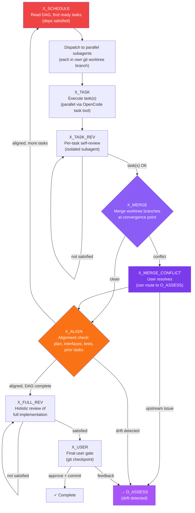
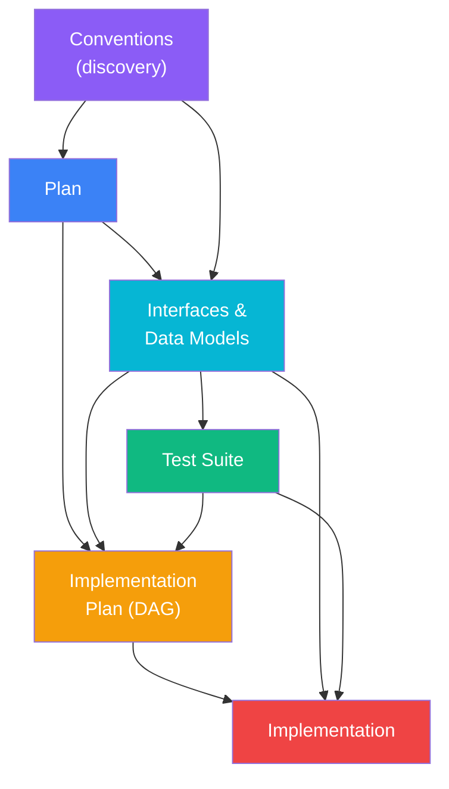

# Structured Coding Workflow — Design Document

**Version:** v6
**Date:** March 2026
**Companion doc:** `structured-workflow-implementation-plan.md`

---

## 1. Problem Statement

AI coding agents fail not because the models lack capability, but because they skip the engineering discipline that produces correct code. They lunge into implementation without a plan, produce interfaces ad-hoc, write tests as an afterthought, and have no mechanism to detect when their foundations are wrong. When they do detect a problem, they rewrite from scratch instead of correcting incrementally — wasting all prior refinement.

Existing agentic harnesses (Ralph Wiggum, Oh My OpenCode, Weave, OpenAgentsControl) optimize for persistence or parallelism but not for structural quality. None enforce phased discipline, none track artifact dependencies, and none can cascade corrections backward through a dependency graph when an upstream artifact is found to be wrong.

Critically, nearly all of them assume greenfield development. In practice, most real engineering work happens in existing codebases — either adding features to a live product or refactoring legacy code toward better patterns. A workflow that doesn't understand the terrain it's operating in will produce technically correct but practically destructive changes.

This plugin enforces a phased, quality-gated workflow that mirrors how experienced engineers actually build software: understand what exists, plan against that reality, define interfaces, write tests, plan the implementation, then implement one task at a time — verifying alignment at every step.

---

## 2. Design Principles

1. **Know the terrain.** Before any planning begins, the agent discovers the existing codebase's structure, conventions, patterns, and constraints. In greenfield mode this is skipped. In existing-project modes this produces a conventions document that constrains all subsequent phases.

2. **Plan before code.** No implementation artifact is produced until the plan, interfaces, tests, and implementation plan have each been individually reviewed and approved.

3. **Revise, never rewrite.** Every iteration is incremental. No feedback path leads to a DRAFT state. Prior approved decisions are preserved and refined.

4. **Single feedback funnel.** All feedback — user review, self-review issues, alignment drift, merge conflict resolution — enters the orchestrator at the same point (O_ASSESS). No feedback bypasses the dependency graph.

5. **Catch drift early.** Alignment is checked after every single task completion, not just at the end. Drift is detected before it compounds across multiple tasks.

6. **Escalate strategic decisions.** Tactical corrections proceed autonomously. Strategic pivots — scope expansion, architectural shifts, deep cascading changes — are escalated to the user with full context.

7. **Isolate reviewers from authors.** Self-review runs in separate subagent sessions that see only the artifact and acceptance criteria, never the conversation that produced it. This eliminates anchoring bias.

8. **Checkpoint everything.** Every user approval creates a git-tagged commit. Every parallel task runs in its own worktree branch. Rollback is always possible.

9. **Do no harm (when told not to).** In incremental mode on existing projects, every change is constrained to the minimum necessary. Existing conventions are respected. Existing tests must continue to pass. Files outside the approved scope cannot be touched.

---

## 3. Workflow Modes

The workflow operates in one of three modes, selected at session start. The mode determines whether a discovery phase runs, what constraints are applied throughout, and how aggressive the agent is allowed to be.

### 3.1 Mode Definitions

| Mode | When to Use | Discovery Phase | Constraints |
|------|------------|-----------------|-------------|
| **Greenfield** | New project, empty or near-empty repo | Skipped | None — full creative freedom. Agent defines all conventions. |
| **Refactor** | Existing project, goal is to improve structure/patterns | Full discovery: scan, analyze, produce assessment + conventions | Agent can modify any file, but must produce a transformation plan showing before/after state. Existing tests must pass after each task. New patterns documented in conventions. |
| **Incremental** | Existing project, goal is to add/fix specific functionality | Full discovery: scan, analyze, produce conventions as constraints | **Do-no-harm directive.** Agent can only modify files explicitly approved in the plan. Existing conventions must be followed. Existing tests must continue to pass. No refactoring outside the scope of the requested change. File allowlist enforced by tool guard. |

### 3.2 Mode Selection State

```mermaid
stateDiagram-v2
    MODE_SELECT: Mode Selection
    D_SCAN: Scan Codebase
    D_ANALYZE: Analyze Patterns
    D_CONVENTIONS: Produce Conventions
    D_USER: User Reviews Discovery
    D_REVISE: Revise Conventions
    P_DRAFT: Draft Plan

    [*] --> MODE_SELECT
    MODE_SELECT --> P_DRAFT: greenfield
    MODE_SELECT --> D_SCAN: existing (refactor or incremental)
    D_SCAN --> D_ANALYZE: scan complete
    D_ANALYZE --> D_CONVENTIONS: analysis complete
    D_CONVENTIONS --> D_USER: conventions drafted
    D_USER --> D_REVISE: feedback → O_ASSESS
    D_USER --> P_DRAFT: approved + commit
    D_REVISE --> D_CONVENTIONS: revised

    note right of MODE_SELECT: User selects mode or\nplugin auto-detects from\ngit history and file count
    note right of D_SCAN: Subagent explorers run in parallel:\nfile structure, LSP symbols,\ntest patterns, git history,\nAGENTS.md / existing docs
    note right of D_CONVENTIONS: Refactor mode: assessment of\nwhat exists + what's wrong\nIncremental mode: conventions\ndocument that constrains all\nsubsequent phases
```

### 3.3 Discovery Phase Detail

The discovery phase uses OpenCode's native tools for codebase analysis. Multiple explorer subagents run in parallel to build a comprehensive picture:

| Explorer | Tools Used | Output |
|----------|-----------|--------|
| **Structure scanner** | `glob`, `list`, `bash` (tree, wc -l) | File tree, module boundaries, package structure, file counts by type |
| **Convention detector** | `grep`, `read`, `bash` (lint configs, .editorconfig, tsconfig) | Coding style, naming patterns, import conventions, formatting rules |
| **Architecture analyzer** | LSP `documentSymbol`, `workspaceSymbol`, `findReferences` | Dependency graph between modules, key abstractions, interface patterns |
| **Test pattern scanner** | `glob` (test files), `read`, `bash` (test runner config) | Test framework, test organization, coverage patterns, test naming |
| **History analyzer** | `bash` (git log, git shortlog, git blame) | Commit patterns, active areas, recent changes, contributor patterns |
| **Existing docs reader** | `read` (AGENTS.md, README.md, CONTRIBUTING.md, docs/) | Existing documented conventions, setup instructions, architecture decisions |

The discovery phase produces a **conventions document** that becomes a first-class artifact in the dependency graph. All subsequent phases are constrained by it.

### 3.4 Mode-Specific Constraints

These constraints are injected into the system prompt at every phase and enforced by the tool guard:

**Refactor mode additions:**
- Plan must include a transformation rationale (why the current pattern is problematic, what the target pattern is, what the migration path looks like)
- Each task must include a "before/after" description showing what changes
- Alignment check verifies existing tests still pass after each task
- Conventions document is updated as new patterns are introduced (living document)

**Incremental mode additions (Do No Harm):**
- Plan review includes: "Does this plan ONLY touch what's necessary for the requested functionality?"
- Interface review includes: "Do these interfaces extend existing patterns rather than introducing new ones?"
- Tool guard enforces a **file allowlist** — only files identified in the approved plan can be written/edited. Any write to an unlisted file is blocked: "This file was not identified in the approved plan. Route through orchestrator if you need to modify it."
- Alignment check includes: "Do ALL existing tests still pass?" (not just the new ones)
- The conventions document is read-only — the agent follows it but cannot modify it
- New code must match existing patterns: naming, error handling, test structure, import style

---

## 4. State Machine

The workflow comprises 40 states across 8 logical groups: mode selection (1), discovery (5), planning (4), interfaces (4), tests (4), impl plan (4), execution engine (9), orchestrator (8), and terminal (1). The mode selection and discovery phase are new in v6.

Note: In greenfield mode, MODE_SELECT transitions directly to P_DRAFT, skipping the 5 discovery states. The effective state count is 35 for greenfield and 40 for existing-project modes.

### 4.1 Complete State Machine

```mermaid
stateDiagram-v2
    direction LR

    state "Mode Selection" as modeselect {
        MODE_SELECT: Select Mode
    }

    state "Discovery" as discovery {
        D_SCAN: Scan Codebase
        D_ANALYZE: Analyze Patterns
        D_CONVENTIONS: Produce Conventions
        D_USER: User Review
        D_REVISE: Revise Conventions

        D_SCAN --> D_ANALYZE: scan complete
        D_ANALYZE --> D_CONVENTIONS: analysis complete
        D_CONVENTIONS --> D_USER: drafted
        D_USER --> D_REVISE: feedback → O_ASSESS
        D_REVISE --> D_CONVENTIONS: revised
    }

    state "Planning" as planning {
        P_DRAFT: Draft Plan
        P_REVIEW: Self-Review Plan
        P_USER: User Review
        P_REVISE: Revise Plan

        P_DRAFT --> P_REVIEW: done
        P_REVIEW --> P_REVIEW: not satisfied
        P_REVIEW --> P_USER: satisfied
        P_USER --> P_REVISE: feedback → O_ASSESS
        P_REVISE --> P_REVIEW: revised
    }

    state "Interfaces & Models" as interfaces {
        I_DRAFT: Build Interfaces
        I_REVIEW: Self-Review Interfaces
        I_USER: User Review
        I_REVISE: Revise Interfaces

        I_DRAFT --> I_REVIEW: done
        I_REVIEW --> I_REVIEW: not satisfied
        I_REVIEW --> I_USER: satisfied
        I_USER --> I_REVISE: feedback → O_ASSESS
        I_REVISE --> I_REVIEW: revised
    }

    state "Tests" as tests {
        T_DRAFT: Write Failing Tests
        T_REVIEW: Self-Review Tests
        T_USER: User Review
        T_REVISE: Revise Tests

        T_DRAFT --> T_REVIEW: done
        T_REVIEW --> T_REVIEW: not satisfied
        T_REVIEW --> T_USER: satisfied
        T_USER --> T_REVISE: feedback → O_ASSESS
        T_REVISE --> T_REVIEW: revised
    }

    state "Implementation Plan (DAG)" as implplan {
        IP_DRAFT: Draft Impl DAG
        IP_REVIEW: Self-Review DAG
        IP_USER: User Review
        IP_REVISE: Revise DAG

        IP_DRAFT --> IP_REVIEW: done
        IP_REVIEW --> IP_REVIEW: not satisfied
        IP_REVIEW --> IP_USER: satisfied
        IP_USER --> IP_REVISE: feedback → O_ASSESS
        IP_REVISE --> IP_REVIEW: revised
    }

    state "Execution Engine" as execution {
        X_SCHEDULE: Schedule Ready Tasks
        X_TASK: Execute Task(s)
        X_TASK_REV: Per-Task Self-Review
        X_MERGE: Merge Gate
        X_MERGE_CONFLICT: User Resolves Conflict
        X_ALIGN: Alignment Check
        X_FULL_REV: Full Impl Review
        X_USER: User Review
        X_REVISE: Revise Impl

        X_SCHEDULE --> X_TASK: dispatch
        X_TASK --> X_TASK_REV: done
        X_TASK_REV --> X_TASK_REV: not satisfied
        X_TASK_REV --> X_MERGE: tasks complete
        X_MERGE --> X_ALIGN: clean merge
        X_MERGE --> X_MERGE_CONFLICT: conflict
        X_MERGE_CONFLICT --> X_ALIGN: resolved
        X_ALIGN --> X_SCHEDULE: next batch
        X_ALIGN --> X_FULL_REV: DAG complete
        X_FULL_REV --> X_FULL_REV: not satisfied
        X_FULL_REV --> X_USER: satisfied
        X_USER --> X_REVISE: feedback → O_ASSESS
        X_REVISE --> X_FULL_REV: revised
    }

    state "Orchestrator" as orchestrator {
        O_ASSESS: Assess Impact
        O_DIVERGE: Divergence Check
        O_PARALLEL_CHECK: Parallel Impact Check
        O_ABORT_TASKS: Abort In-Flight Tasks
        O_USER_DECIDE: User Decision (Escape Hatch)
        O_INTENT: Update Intent
        O_PLAN: Build Change Plan
        O_ROUTE: Route to Phase

        O_ASSESS --> O_DIVERGE: impact scoped
        O_DIVERGE --> O_PARALLEL_CHECK: tactical
        O_DIVERGE --> O_USER_DECIDE: strategic pivot
        O_PARALLEL_CHECK --> O_PLAN: no parallel impact
        O_PARALLEL_CHECK --> O_ABORT_TASKS: deps changed
        O_ABORT_TASKS --> O_PLAN: tasks aborted
        O_USER_DECIDE --> O_INTENT: accept / redirect
        O_USER_DECIDE --> X_ALIGN: abort change
        O_INTENT --> O_PARALLEL_CHECK: intent updated
        O_PLAN --> O_ROUTE: plan ready
    }

    DONE: ✓ Complete

    %% Mode selection and discovery
    MODE_SELECT --> D_SCAN: existing project
    MODE_SELECT --> P_DRAFT: greenfield
    D_USER --> P_DRAFT: approve + commit

    %% Phase advances (user approval + git checkpoint)
    P_USER --> I_DRAFT: approve + commit
    I_USER --> T_DRAFT: approve + commit
    T_USER --> IP_DRAFT: approve + commit
    IP_USER --> X_SCHEDULE: approve + commit
    X_USER --> DONE: approve + commit

    %% Feedback to orchestrator (from self-reviews)
    I_REVIEW --> O_ASSESS: upstream issue
    T_REVIEW --> O_ASSESS: upstream issue
    IP_REVIEW --> O_ASSESS: upstream issue
    X_FULL_REV --> O_ASSESS: upstream issue
    X_ALIGN --> O_ASSESS: drift detected
    X_MERGE_CONFLICT --> O_ASSESS: upstream issue

    %% Feedback to orchestrator (from user gates)
    D_USER --> O_ASSESS: any feedback
    P_USER --> O_ASSESS: any feedback
    I_USER --> O_ASSESS: any feedback
    T_USER --> O_ASSESS: any feedback
    IP_USER --> O_ASSESS: any feedback
    X_USER --> O_ASSESS: any feedback

    %% Orchestrator routes to REVISE states (never DRAFT)
    O_ROUTE --> D_REVISE: → conventions
    O_ROUTE --> P_REVISE: → plan
    O_ROUTE --> I_REVISE: → interfaces
    O_ROUTE --> T_REVISE: → tests
    O_ROUTE --> IP_REVISE: → impl plan
    O_ROUTE --> X_REVISE: → impl
```



### 4.2 Phase Pattern (Repeating Unit)

Every sequential phase follows this identical four-state pattern:

```mermaid
stateDiagram-v2
    DRAFT: Draft Artifact
    REVIEW: Self-Review (isolated subagent)
    USER: User Gate (git checkpoint on approve)
    REVISE: Revise Artifact (via orchestrator)

    DRAFT --> REVIEW: done
    REVIEW --> REVIEW: not satisfied (loop)
    REVIEW --> USER: satisfied
    USER --> REVISE: feedback → orchestrator
    USER --> next_phase: approve + commit
    REVISE --> REVIEW: revised

    note right of REVIEW: Runs in isolated subagent session.\nSees only artifact + criteria.\nNo authoring context.
    note right of USER: All feedback routes through O_ASSESS.\nNo direct edge to REVISE.
    note left of REVISE: Incremental only.\nPreserves prior approved work.\nEntered via O_ROUTE, never directly.
```

### 4.3 Orchestrator Decision Flow

```mermaid
flowchart TD
    TRIGGER["Feedback received\n(user gate / self-review / alignment / merge conflict)"]
    ASSESS["O_ASSESS\nIdentify affected artifacts\nWalk dependency graph"]
    DIVERGE{"O_DIVERGE\nTactical or strategic?"}
    PARALLEL{"O_PARALLEL_CHECK\nIn-flight tasks affected?"}
    ABORT["O_ABORT_TASKS\nCancel affected subagents\nDiscard worktree branches"]
    USER_DECIDE{"O_USER_DECIDE\nPresent: original intent,\ndetected divergence,\nproposed changes, impact"}
    INTENT["O_INTENT_UPDATE\nRecord new baseline intent"]
    PLAN["O_PLAN\nBuild minimal revision list\nTarget REVISE states only"]
    ROUTE["O_ROUTE\nDispatch to earliest\naffected REVISE state"]
    RETURN["Return to X_ALIGN\n(abort change, continue as-is)"]

    TRIGGER --> ASSESS
    ASSESS --> DIVERGE
    DIVERGE -->|"Tactical:\nsingle artifact,\nno scope change,\n≤2 artifacts affected"| PARALLEL
    DIVERGE -->|"Strategic:\nscope expansion,\narch shift,\n3+ artifacts,\naccumulated drift"| USER_DECIDE
    USER_DECIDE -->|"Accept drift /\nNew direction /\nAlternative"| INTENT
    USER_DECIDE -->|"Abort change"| RETURN
    INTENT --> PARALLEL
    PARALLEL -->|"No in-flight impact"| PLAN
    PARALLEL -->|"Independence\ninvalidated"| ABORT
    ABORT --> PLAN
    PLAN --> ROUTE

    style TRIGGER fill:#f97316,color:#fff
    style USER_DECIDE fill:#ec4899,color:#fff
    style ABORT fill:#dc2626,color:#fff
    style DIVERGE fill:#a855f7,color:#fff
    style ROUTE fill:#a855f7,color:#fff
```

### 4.4 Execution Engine Flow



---

## 5. Artifact Dependency Graph

Artifacts are the outputs of each phase. When the orchestrator receives feedback, it identifies the affected artifact, then walks this graph forward to determine the full cascade of downstream artifacts needing re-validation.



**Cascade examples:**

- Revising **Conventions** invalidates: Plan, Interfaces, Tests, Impl Plan, Implementation (5 downstream — everything). This is rare and triggers the escape hatch.
- Revising **Interfaces** invalidates: Tests, Impl Plan, Implementation (3 downstream)
- Revising **Plan** invalidates: Interfaces, Tests, Impl Plan, Implementation (4 downstream)
- Revising **Tests** invalidates: Impl Plan, Implementation (2 downstream)
- Revising **Impl Plan** invalidates: Implementation only (1 downstream)

Note: In greenfield mode, the Conventions artifact does not exist. The dependency graph starts at Plan.

---

## 6. State Inventory

### 6.1 Mode Selection (1 state)

| State | Type | Role |
|-------|------|------|
| MODE_SELECT | Entry | User selects greenfield/refactor/incremental, or plugin auto-detects from git history and file count |

### 6.2 Discovery Phase (5 states, skipped in greenfield mode)

| State | Type | Role |
|-------|------|------|
| D_SCAN | Action | Parallel subagent explorers scan: file structure, LSP symbols, test patterns, git history, existing docs |
| D_ANALYZE | Action | Synthesize scan results into a coherent picture of architecture, conventions, and (in refactor mode) problems |
| D_CONVENTIONS | Action | Produce the conventions document. In refactor mode: assessment + target state. In incremental mode: conventions as constraints |
| D_USER | User Gate | User reviews and approves the conventions document. Git checkpoint on approval |
| D_REVISE | Action | Incremental revision of conventions via orchestrator |

### 6.3 Sequential Phases (16 states)

| Phase | States | Artifact Produced |
|-------|--------|-------------------|
| Planning | P_DRAFT, P_REVIEW, P_USER, P_REVISE | Plan: scope, approach, architecture, constraints |
| Interfaces | I_DRAFT, I_REVIEW, I_USER, I_REVISE | Interface definitions, type definitions, data models |
| Tests | T_DRAFT, T_REVIEW, T_USER, T_REVISE | Comprehensive failing test suite |
| Impl Plan | IP_DRAFT, IP_REVIEW, IP_USER, IP_REVISE | DAG of tasks with dependencies and parallelism markers |

### 6.4 Execution Engine (9 states)

| State | Type | Role |
|-------|------|------|
| X_SCHEDULE | Scheduler | Reads DAG, identifies ready tasks, dispatches parallel subagents in worktree branches |
| X_TASK | Action | One or more tasks execute in parallel via subagents |
| X_TASK_REV | Review | Per-task self-review in isolated subagent session |
| X_MERGE | Merge Gate | Reconciles parallel branch outputs at convergence points |
| X_MERGE_CONFLICT | User Gate | Fires only on actual merge conflicts. Can route to O_ASSESS |
| X_ALIGN | Checkpoint | Post-merge alignment against plan, interfaces, tests, prior tasks |
| X_FULL_REV | Review | Holistic review when entire DAG is complete |
| X_USER | User Gate | Final approval gate with git checkpoint |
| X_REVISE | Action | Incremental revision via orchestrator |

### 6.5 Orchestrator (8 states)

| State | Role |
|-------|------|
| O_ASSESS | Entry point for ALL feedback. Scopes impact via dependency graph. |
| O_DIVERGE | Classifies change as tactical (autonomous) or strategic (user decision). |
| O_PARALLEL_CHECK | Checks if revision invalidates dependency graph for in-flight tasks. |
| O_ABORT_TASKS | Cancels in-flight subagents whose independence is invalidated. |
| O_USER_DECIDE | Escape hatch. Presents original intent, divergence, proposed changes, options. |
| O_INTENT_UPDATE | Records user decision as new baseline for future divergence checks. |
| O_PLAN | Builds minimal ordered revision plan targeting REVISE states. |
| O_ROUTE | Dispatches to earliest affected REVISE state with change plan in context. |

### 6.6 Terminal (1 state)

| State | Role |
|-------|------|
| DONE | All phases complete, all tests pass, user approved final implementation. |

---

## 7. User Touchpoints

The workflow has up to 6 planned touchpoints and 2 conditional ones (5 planned in greenfield mode):

| Touchpoint | Type | When |
|------------|------|------|
| D_USER | Phase gate (existing projects only) | Discovery complete, conventions drafted and self-reviewed |
| P_USER | Phase gate | Plan complete and self-reviewed |
| I_USER | Phase gate | Interfaces complete and self-reviewed |
| T_USER | Phase gate | Tests complete and self-reviewed |
| IP_USER | Phase gate | Implementation DAG complete and self-reviewed |
| X_USER | Phase gate | Full implementation complete and self-reviewed |
| O_USER_DECIDE | Escape hatch (conditional) | Strategic pivot detected by divergence check |
| X_MERGE_CONFLICT | Merge conflict (conditional) | Auto-reconciliation failed at merge gate |

Between these touchpoints, the agent operates autonomously: self-reviewing, aligning, correcting tactical drift via the orchestrator, and executing parallel tasks.

---

## 8. Feedback Routing Matrix

Every feedback point and exactly which artifacts it can trigger revisions to. All paths go through O_ASSESS.

| Source | Phase | Reachable Artifacts |
|--------|-------|---------------------|
| D_USER | Discovery | Conventions |
| P_USER | Planning | Conventions, Plan |
| I_USER | Interfaces | Conventions, Plan, Interfaces |
| I_REVIEW | Interfaces (auto) | Conventions, Plan, Interfaces |
| T_USER | Tests | Plan, Interfaces, Tests |
| T_REVIEW | Tests (auto) | Plan, Interfaces, Tests |
| IP_USER | Impl Plan | Plan, Interfaces, Tests, Impl Plan |
| IP_REVIEW | Impl Plan (auto) | Plan, Interfaces, Tests, Impl Plan |
| X_USER | Implementation | All artifacts |
| X_ALIGN | Per-task (auto) | All artifacts |
| X_FULL_REV | Full review (auto) | All artifacts |
| X_MERGE_CONFLICT | Merge (conditional) | All artifacts |
| O_USER_DECIDE | Escape hatch | All artifacts + intent baseline |

---

## 9. Divergence Detection Criteria

The divergence check at O_DIVERGE classifies proposed changes as tactical or strategic. Any one of these criteria is sufficient to trigger the escape hatch:

| Criterion | Description | Example |
|-----------|-------------|---------|
| Scope expansion | Change plan adds artifacts or capabilities not in the original approved plan | "We need a new microservice" when the plan specified a monolith |
| Architectural shift | Change requires modifying fundamental data model, API structure, or system boundaries | Changing from REST to GraphQL mid-implementation |
| Cascade depth ≥ 3 | Dependency walk shows 3+ artifacts need revision | Revising interfaces invalidates tests, impl plan, and implementation |
| Accumulated drift | Total semantic distance of all revisions since last user approval exceeds threshold | Ten individually-minor interface changes that collectively redesign the API |

**Threshold tuning:** Accumulated drift is measured by comparing the current artifact state against the state at the last user approval checkpoint. The comparison uses a subagent LLM call with structured output. The threshold should err toward false positives (escalating when unnecessary) rather than false negatives (missing a strategic pivot). Users can dismiss false positives via the "abort change" option with minimal friction.

---

## 10. Git Strategy

```mermaid
gitgraph
    commit id: "initial"
    commit id: "workflow/plan-v1" tag: "plan-approved"
    commit id: "workflow/interfaces-v1" tag: "interfaces-approved"
    commit id: "workflow/tests-v1" tag: "tests-approved"
    commit id: "workflow/dag-v1" tag: "dag-approved"
    branch task/auth-service
    commit id: "task: auth-service"
    checkout main
    branch task/user-model
    commit id: "task: user-model"
    checkout main
    merge task/auth-service id: "merge: auth-service"
    merge task/user-model id: "merge: user-model"
    commit id: "workflow/complete" tag: "complete"
```

| Event | Git Action |
|-------|------------|
| User approves at phase gate | `git add -A && git commit && git tag workflow/<phase>-v<N>` |
| Parallel task dispatched | `git worktree add -b task/<id> .worktrees/<id> HEAD` |
| Task completes, passes review | Task branch ready for merge |
| Merge gate (clean) | `git merge --no-ff task/<id>` + worktree cleanup |
| Merge gate (conflict) | User resolves, then merge commit |
| Parallel abort | `git worktree remove --force` + `git branch -D` |
| Escape hatch "abort change" | `git reset --hard <last-checkpoint-tag>` |
| Orchestrator revision cascade | Revisions committed on main, re-tagged on next approval |

---

## 11. Per-Phase Acceptance Criteria

These are the structured checklists that the isolated reviewer subagent evaluates against at each self-review state.

### Conventions (Discovery — Refactor Mode)
- Existing architecture accurately described (module boundaries, key abstractions, data flow)
- Current patterns documented with examples (naming, error handling, test structure, import style)
- Problem areas identified with specific evidence (not just "this could be better")
- Target state described for each problem area
- Migration path from current to target state is feasible and incremental
- Risk areas identified (areas with high coupling, no test coverage, or complex state)

### Conventions (Discovery — Incremental Mode)
- Existing architecture accurately described
- All coding conventions documented: naming, file organization, import patterns, error handling
- Test patterns documented: framework, file naming, assertion style, fixture patterns
- Existing AGENTS.md / CONTRIBUTING.md content incorporated
- Constraint list produced: which patterns the agent must follow, which files should not be touched

### Plan
- All user requirements explicitly addressed
- Error and failure cases specified
- Ambiguous decisions made explicit (no "TBD" items)
- Data flow described between components
- Integration points with external systems identified
- Non-functional requirements (performance, security, scalability) addressed

### Interfaces & Data Models
- Every method specifies input types, output types, and error types
- Data models include all relationships and constraints
- Naming consistent with plan terminology
- No missing CRUD operations for data entities
- Validation rules specified for all inputs
- Consistent error handling pattern across all interfaces

### Tests
- At least one test per interface method
- Edge cases covered: empty input, max values, null/undefined, boundary conditions
- Failure modes tested: network errors, invalid data, auth failures, timeouts
- Tests are expected to fail (no implementation leakage)
- Test descriptions map directly to interface specifications

### Implementation Plan (DAG)
- Every interface covered by at least one task
- Task dependencies are correct and acyclic
- Parallelizable tasks have no shared mutable state
- Merge points identified at dependency convergence
- Expected test outcomes specified per task
- Complexity estimates assigned per task

### Per-Task Alignment
- Task output matches interface signatures exactly
- Relevant tests for this task pass
- No regressions in previously-passing tests
- Output consistent with all prior completed tasks
- No drift from the approved plan

---

## 12. Escape Hatch User Experience

When the escape hatch fires, the agent presents a structured summary:

**1. Original Intent** — what the user asked for and what was approved at each prior gate.

**2. Detected Divergence** — specifically what changed and why the orchestrator flagged it, including which trigger criterion was met (scope expansion, architectural shift, cascade depth, or accumulated drift).

**3. Proposed Change Plan** — what the orchestrator would do if allowed to proceed: which artifacts would be revised, in what order, and how far back the cascade goes.

**4. Impact Assessment** — concrete list of affected artifacts and estimated scope of revision.

The user then chooses from:

| Option | What Happens |
|--------|-------------|
| **Accept drift and update intent** | Intent baseline updated. Change plan proceeds against new intent. Full cascade runs. |
| **Provide alternative direction** | User describes a different approach. Intent updated with user's direction. Orchestrator rebuilds change plan. |
| **Provide entirely new direction** | Neither original nor detected drift is right. User provides new requirements. Full re-assessment. |
| **Abort change, continue as-is** | Return to where we were. No revisions. Last checkpoint tag is the rollback point if needed. |

---

## 13. Design Invariants

These must hold true at all times. Any implementation change should be validated against this list.

1. **All feedback through orchestrator.** No feedback path bypasses O_ASSESS.
2. **All iterations are revisions.** O_ROUTE only targets REVISE states, never DRAFT states.
3. **Alignment at every merge point.** X_ALIGN runs after every merge gate and every sequential task.
4. **Strategic pivots require user decision.** O_DIVERGE gates all change plans.
5. **Pivots update intent before cascading.** O_INTENT_UPDATE fires before O_PLAN.
6. **Revisions cascade through dependency graph.** Downstream dependents re-enter self-review → user gate.
7. **Parallel abort on dependency invalidation.** In-flight tasks whose independence is invalidated are aborted.
8. **Git checkpoint on every user approval.** Tagged commits at every gate, worktree branches per task.
9. **Merge conflicts and escape hatch are the only unplanned user touchpoints.**
10. **Self-review uses isolated subagent sessions.** No authoring context visible to reviewer.
11. **Discovery constrains all subsequent phases (existing-project modes).** The conventions document is a first-class artifact in the dependency graph. Every subsequent phase's acceptance criteria and system prompt include conventions compliance.
12. **Incremental mode enforces a file allowlist.** Only files identified in the approved plan can be written or edited. The tool guard blocks all other file modifications.
13. **40 states total (35 in greenfield mode), up to 6 phase gates, 1 escape hatch, 1 conditional merge conflict gate, 1 per-task alignment checkpoint.**

---

## 14. Comparison with Existing Approaches

| Dimension | Ralph Wiggum | Oh My OpenCode | Weave | This Plugin |
|-----------|-------------|----------------|-------|-------------|
| Core pattern | `while(true)` loop | Multi-agent orchestration | Plan → Review → Execute | Phased state machine with dependency DAG |
| State tracking | None (infers from git) | Session-level | Plan file with checkboxes | 40-state machine persisted to JSON |
| Quality control | None structural | Approval-biased review (unblock, don't block) | Single review pass (Weft) | Iterative self-review per phase with structured checklists in isolated sessions |
| User involvement | Fire-and-forget | Interview mode at start | Plan approval | 5 phase gates + escape hatch + merge conflicts |
| Dependency tracking | None | None | None | Full artifact dependency graph with cascade |
| Backtracking | None (forward only) | None | None | Orchestrator routes to any upstream REVISE state |
| Divergence detection | None | None | None | O_DIVERGE with 4 trigger criteria + escape hatch |
| Parallelism | None (single loop) | Background tasks | Sequential | DAG-driven with merge gates and parallel abort |
| Git integration | Inferred from history | None structural | Checkpoint-based resume | Tagged commits, worktree branches, merge commits |
| Best for | Mechanical tasks | Multi-repo, hybrid stacks | Standard features | Complex features where correctness matters |
| Existing project support | None | Codebase-aware via context files | None structural | Full discovery phase, 3 modes (greenfield/refactor/incremental), do-no-harm directive with file allowlist |
